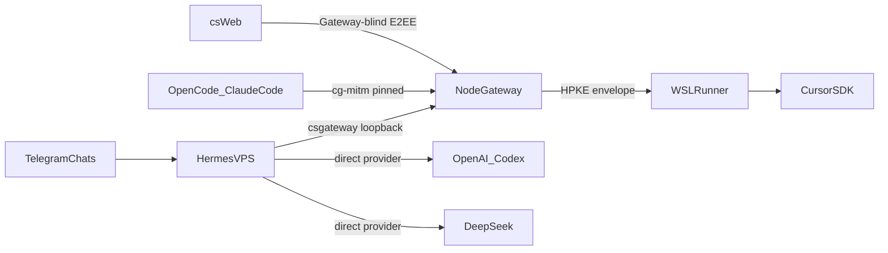

# Cursor Gateway 性能与 Hermes 多 Provider 重构计划

## 1. 目标与边界

本计划保留 VPS 上的 Hermes，不将其整体迁移到 WSL。最终系统分为：

- Node Gateway：认证、Web E2EE 密文中继、CSAPI 协议转换、队列和报告 API。
- VPS Hermes Gateway：Telegram 会话与 provider 路由，支持 `csgateway`、OpenAI Codex、DeepSeek。
- WSL Runner：只承担 `csgateway` 路径上的 Cursor SDK、Hermes/Cursor 工具和文件操作。
- PostgreSQL：持久化队列、密文、设备状态、Telegram 会话和报告。
- Nginx：直接提供 Web 静态文件和最新安装包。

信任边界：

- 信任 VPS 和 WSL 内真正执行 Hermes/Cursor 的进程。
- 不信任客户端与 Runner 前面的 TLS 代理、伪证书或网络网关。
- OpenCode/Claude Code 到 VPS 使用固定根的 `cg-mitm/1`。
- VPS 到 WSL Runner 使用绑定 Runner 身份的 HPKE envelope；网络网关只看到密文。
- `cs.joelzt.org` Web 加密会话继续保持 Gateway-blind E2EE。
- Telegram Bot 消息对 Telegram 官方服务器可见；这是 Telegram Bot API 的固有限制。

## 2. 基线与量化指标

2026-07-22 生产基线：

- Node 进程 RSS 约 120 MiB，PSS 约 119 MiB，已观测 RSS 峰值约 137 MiB。
- app 容器约 160 MiB。
- PostgreSQL 约 38 MiB，Redis 约 2.5 MiB。
- Hermes 常驻约 297–349 MiB，已观测峰值 364 MiB、Swap 峰值 96 MiB。
- Docker Gateway 栈约 200 MiB；加入 Hermes 后约 500–550 MiB。
- Node 容器启动到 listen 约 4.54 秒，到健康检查成功约 5.70 秒。
- Runner 空闲时由 job、配对、审批等循环产生约 3–5 次请求/秒。
- VPS 为 2 vCPU、约 2 GiB RAM。

验收目标：

- Node 进程：
  - 10 分钟稳态平均 RSS 不超过 100 MiB。
  - 三路 Telegram + 一路 Web E2EE 压力下 p95 RSS 不超过 160 MiB。
  - 容器硬限制 256 MiB，测试期间不得发生 OOM、重启或持续 Swap。
- PostgreSQL：
  - 稳态不超过 50 MiB，压力测试 p95 不超过 80 MiB。
  - 连接池默认 3，容器硬限制 128 MiB。
- VPS Hermes：
  - 单共享进程，不按 chat 或 provider 复制进程。
  - 稳态目标不超过 320 MiB。
  - 三路并发 provider 请求时 p95 不超过 420 MiB。
  - 保留 `MemoryHigh=384M`、`MemoryMax=512M`、`MemorySwapMax=128M`，不得触发 OOM。
- 整体：
  - 稳态目标不超过 460 MiB；三路并发测试 p95 不超过 650 MiB。
  - 通过资源上限把 Node + PostgreSQL + Hermes 的理论失控范围限制在 896 MiB 内，为系统和文件缓存保留超过 1 GiB。
- CPU：
  - Runner 空闲请求率从约 3–5 req/s 降至不超过 0.2 req/s，下降超过 90%。
  - Node + PostgreSQL 空闲 CPU 相对基线下降至少 50%。
  - Hermes 设置 `CPUQuota=100%`，Node 容器限制 0.5 CPU，PostgreSQL 限制 0.35 CPU；在 2 vCPU VPS 上为 Nginx 和系统保留余量。
  - 三路 Telegram 并发期间不能出现超过 10 秒的持续 CPU 饱和。
- 冷启动：
  - Node 从进程启动到 listen 的 20 次测试 p95 小于 3 秒。
  - Hermes Gateway 从启动到 Telegram ready 的 10 次测试 p95 小于 5 秒。
  - Telegram 收到消息后 3 秒内完成 ack/入队；模型完整响应时间不计入该指标。

保留 VPS Hermes 意味着整套服务平均 100 MiB 不可能实现；100 MiB 指标仅适用于 Node Gateway。整栈内存优化的现实目标是约 15%–25%，CPU 与请求数量优化目标超过 50%。

## 3. Hermes 与 Telegram 多 Provider

### 3.1 会话和并发

“至少 3 条 Telegram”按以下可测试语义实现：

- 至少 3 个独立 Telegram `chat_id` 同时发起请求。
- 同一 `chat_id` 严格串行，防止上下文交叉。
- 不同 `chat_id` 最多 3 路并行。
- 第 4 路及以后进入有界队列，不创建额外 Hermes 进程。
- 队列上限 30；超过上限立即返回忙碌提示，不允许内存无限增长。
- 每个请求设置执行超时和取消状态；客户端重复提交使用幂等键去重。

### 3.2 Provider 路由

VPS Hermes 保留三个明确 provider：

- `csgateway`：Hermes 通过 VPS loopback/Unix socket 调用 Node Gateway；Node Gateway 将任务重新加密后交给 WSL Runner 的 Cursor SDK。
- `openai-codex`：Hermes 使用 VPS 现有已购买账号/凭据直接调用，不经过 WSL。
- `deepseek`：Hermes 使用 VPS 现有 provider 凭据直接调用，不经过 WSL。

每个 Telegram 会话持久化自己的 provider、model、workspace 和 conversation。增加或对齐以下命令：

- `/provider`：显示当前 provider 和可选 provider。
- `/provider csgateway`
- `/provider openai-codex`
- `/provider deepseek`
- `/model`、`/workspace`、`/new`、`/status`、`/cancel`

Provider 必须 fail-closed：

- Codex 或 DeepSeek 失败时不得自动把内容发送给另一个 provider。
- `csgateway` 的 Runner 身份或签名验证失败时不得回退到明文 Runner API。
- 日志只记录 provider、run ID、耗时、token 计数和错误类别，不记录 prompt、response、token 或凭据。

### 3.3 进程布局

- 保留一个 `hermes-gateway-telegram2.service` 常驻进程。
- 禁止为三个会话启动三个 Hermes Gateway。
- Provider HTTP 客户端连接池共享并设置最大连接数、响应体上限和超时。
- 关闭未使用的 Hermes MCP、浏览器、向量数据库和本地工具；当前 `HERMES_DISABLE_MCP=1` 保持。
- `csgateway` 的 Cursor/文件工具只在 WSL Runner 中运行。
- Node 自带的 Telegraf Telegram 入口关闭并移除常驻依赖，避免与 Hermes Telegram Gateway 重复消费 update。

## 4. 两跳应用层加密

### 4.1 OpenCode / Claude Code

- 保留 [`apps/secure-adapter`](../apps/secure-adapter) 的 loopback Anthropic/OpenAI 兼容门面。
- Secure Adapter 继续验证离线 Ed25519 根和 VPS 身份证书，再建立 `cg-mitm/1` 会话。
- 生产设置 `CG_REQUIRE_SECURE=true`；公网不挂载明文 `/v1/*`。
- 为 VPS Hermes 保留仅绑定 `127.0.0.1` 或 Unix socket 的内部兼容入口，不能经公网访问。

### 4.2 VPS 到 Runner

- 从 [`apps/server/src/csapi/csRelayDispatch.ts`](../apps/server/src/csapi/csRelayDispatch.ts) 抽取通用 `dispatchTrustedVpsRun()`。
- 复用 [`apps/server/src/e2eeDb.ts`](../apps/server/src/e2eeDb.ts) 的 E2EE 队列、租约和幂等约束。
- VPS 使用 Runner 心跳注册的 HPKE 公钥加密 prompt、history、memory 和执行参数。
- Runner 在 [`apps/windows-runner/src/e2eeProcessor.ts`](../apps/windows-runner/src/e2eeProcessor.ts) 中验证 VPS 签名、来源、sequence、previous digest 和 message ID 后才解密执行。
- Runner 使用本机签名私钥签名结果；VPS 在解密结果前验证签名和 Runner 身份。
- Telegram `csgateway`、OpenCode/Claude Code 和 VPS Hermes loopback 请求统一使用该路径。
- 删除这些路径对 legacy plaintext Runner claim 的回退。

伪证书测试必须证明：

- 替换客户端信任的 TLS 证书但没有离线签名根时，Secure Adapter 拒绝连接。
- Runner 前置代理即使拥有系统受信任证书，也无法解密 HPKE payload。
- 重放旧 envelope、篡改 ciphertext、伪造 Runner result 均被拒绝。

## 5. Node、数据库与轮询优化

### 5.1 启动和内存

- 将 [`apps/server/src/routes.ts`](../apps/server/src/routes.ts) 拆为 core、E2EE、runner、CSAPI、reports、automation、downloads 模块。
- [`apps/server/src/index.ts`](../apps/server/src/index.ts) 不再静态导入 Telegraf、静态文件插件、报告和未启用的兼容入口。
- 将 [`apps/server/src/db.ts`](../apps/server/src/db.ts) 的 DDL 提取为版本化 one-shot migration；部署先迁移再启动 Node。
- PostgreSQL pool 从 10 降为 3，并对 acquire/query 设置超时。
- 删除 `bullmq`、`@fastify/jwt`、Telegraf 和最终未使用的 server 依赖。
- Docker runtime 只安装 server/shared/e2ee 的 production dependencies。
- Node 使用经压力测试确认的 heap 上限，并对 request body、并发 session、幂等缓存和 SSE 客户端设置硬上限。

### 5.2 CPU 和请求率

- 将普通、E2EE 和 Hermes job claim 改为 25 秒长轮询。
- 将六类 pairing/approval claim 合并为一个批量长轮询端点。
- job 创建时使用进程内 waiter 唤醒长轮询；持久状态仍在 PostgreSQL。
- Runner 网络错误采用指数退避和 jitter，成功长轮询超时后立即重连。
- 心跳维持 60 秒；空闲 heartbeat 不写详细 audit。
- stale-run 清理从每次 heartbeat 改为固定低频维护任务。
- CSAPI 等待结果从固定 400ms DB 查询改为 waiter + 超时兜底。
- 单实例部署使用进程内 sync bus，移除 Redis；服务重启后客户端重连并从 PostgreSQL 恢复。

## 6. Web 加密会话与安装包

- 保留 `cs.joelzt.org` 的 E2EE 会话、RAMC、Passkey、设备批准、恢复、撤销、Memory 和密文历史。
- Web E2EE 请求不经过 VPS 明文 Hermes provider。
- Nginx 直接提供 `apps/web/dist` 和下载目录，Node 不加载 `@fastify/static`。
- 仅保留最新：
  - `cursor-gateway-secure.zip`
  - Secure Desktop zip
  - `release.json`
- 删除 Docker 镜像中的解包 Electron 目录和旧版本。
- 下载路径继续由 Cloudflare Access/Nginx `auth_request` 保护。
- 下载 500 MiB 文件的测试期间，Node RSS 增量不得超过 5 MiB。

## 7. 每日汇报资源隔离

- 报告路由和模板不进入核心冷启动 import graph。
- `runs` 增加 priority；交互任务为 0，报告为 -10。
- 报告只读、并发 1、固定超时，交互队列存在时不领取报告。
- 报告生成放入独立低优先级 worker/cgroup，设置 `CPUQuota=25%`、`MemoryMax=192M`、`Nice=10`。
- 报告失败只记录错误并等待下一次调度，不允许快速重试循环。
- 报告 API 仍可浏览历史和发起问答。

## 8. Docker 与 systemd 资源控制

[`infra/docker-compose.yml`](../infra/docker-compose.yml)：

- app：0.5 CPU，256 MiB memory，64 PIDs。
- postgres：0.35 CPU，128 MiB memory，64 PIDs。
- 删除 Redis service。
- healthcheck 采用低频、短超时；启动期不反复触发昂贵检查。

Hermes systemd drop-in：

- `MemoryAccounting=true`
- `MemoryHigh=384M`
- `MemoryMax=512M`
- `MemorySwapMax=128M`
- `CPUAccounting=true`
- `CPUQuota=100%`
- `TasksMax=128`
- `OOMPolicy=stop`
- 保留失败退避，加入启动频率限制，避免崩溃循环消耗 CPU。

资源限制不是替代优化：任何触碰 `MemoryHigh`、Swap 持续增长或被 cgroup throttle 的测试都视为性能失败。

## 9. 测试计划

### 9.1 单元测试

- Provider 路由：三个 provider 精确选择、未知 provider 拒绝、禁止自动 fallback。
- Telegram session：不同 `chat_id` 状态隔离；同 chat 串行；跨 chat 并行。
- 并发限制：全局最多 3 个 active，请求 4–30 排队，第 31 个拒绝。
- 幂等与取消：重复 update/run ID 不重复执行；排队任务可取消。
- 加密：HPKE round-trip、错误 key、篡改 AAD/ciphertext、过期 key、sequence 回退、message ID 重放。
- 签名：错误 VPS 签名、错误 Runner 签名、撤销 Runner 均 fail-closed。
- 队列：租约过期重领、同 conversation 不并发、报告优先级低于交互任务。
- 配置：公网明文 `/v1/*` 不挂载，loopback 内部入口拒绝非 loopback 来源。

### 9.2 集成测试

- 三个不同 Telegram `chat_id` 同时选择 `csgateway`，分别获得正确且不串线的 Cursor 结果。
- 三个 chat 分别选择 `csgateway`、OpenAI Codex、DeepSeek，并发完成且 provider 不串线。
- 同一 chat 连续两条消息严格按顺序执行。
- WSL Runner 离线时，`csgateway` 返回明确离线状态；Codex/DeepSeek 仍可使用。
- Codex 失败不向 DeepSeek 或 csgateway 泄漏 prompt，反之亦然。
- OpenCode Anthropic 与 OpenAI wire：非流式、SSE、会话、取消、429。
- Web：E2EE 新会话、历史、Memory、RAMC、Passkey、恢复、撤销全部回归。
- 安装包：鉴权、Range、断点续传、校验和、最新版 retention。
- 报告：与交互任务同时排队时，三个交互任务先完成，报告随后单并发执行。

真实 Codex/DeepSeek 测试只发送固定无敏感信息的最小 prompt，并设置每日测试预算；CI 默认使用 mock provider。

### 9.3 安全测试

- Secure Adapter 连接伪造 TLS 服务，确认离线根验证失败。
- Runner 流量经可解密 TLS 的测试代理转发，代理日志和抓包中不得出现 prompt/response。
- PostgreSQL 中 Runner hop 只出现 envelope，不出现 `csgateway` prompt。
- 重放、乱序、篡改、错误 Runner key、撤销设备全部拒绝。
- 日志扫描确认没有 API key、Telegram token、Codex/DeepSeek 凭据、prompt 或 response。

### 9.4 性能测试

- 冷启动：Node 20 次、Hermes 10 次，记录 p50/p95/max。
- 空闲测试：30 分钟，记录每分钟 HTTP 请求数、Node/PG/Hermes RSS/PSS、CPU、Swap。
- 三路 Telegram：三个 chat 同时持续 20 轮，共 60 次请求，混合三个 provider。
- 峰值测试：3 Telegram + 1 OpenCode SSE + 1 Web E2EE + 1 报告排队，持续 30 分钟。
- Soak：2 小时混合负载，确认无内存持续增长、无 OOM、无服务重启、无租约重复执行。
- 下载：并发下载最新大安装包，确认 Node CPU/RSS 基本不变。
- 故障：Runner 断网、provider 429/5xx、PostgreSQL 短暂不可用，确认指数退避且无请求风暴。

每次性能测试保存：

- `docker stats` 与 cgroup `memory.current/memory.peak/cpu.stat`
- Node `/proc/1/smaps_rollup`
- Hermes systemd `MemoryCurrent/MemoryPeak/CPUUsageNSec`
- PostgreSQL 连接数和慢查询
- Nginx 路径请求率和 p50/p95/p99 延迟
- OOM、重启、Swap、throttle 计数

## 10. 实施顺序

1. 固化当前资源和功能基线，新增测试脚本与结果模板。
2. 实现通用可信 VPS → Runner HPKE 派发和服务端结果签名验证。
3. 让 VPS Hermes 的 `csgateway` provider 使用 loopback 安全入口和加密 Runner 队列。
4. 增加 Telegram provider/session/并发控制，完成三 chat 并发测试；保留 Codex 和 DeepSeek。
5. 拆分 Node 路由、移出 migration、裁剪依赖和 Docker runtime。
6. 实现长轮询、批量 pairing、waiter 和低频维护，移除 Redis。
7. 将 Web 和最新安装包切到 Nginx；验证下载不占 Node 内存。
8. 增加报告优先级和独立资源限制。
9. 在 staging 跑完整功能、安全、性能和 soak 测试。
10. 先部署向后兼容的 Runner，再部署 VPS；开启 secure-only 和 encrypted-runner；保留旧接口但拒绝新任务。
11. 验收稳定后删除 legacy plaintext Runner 路径和旧 artifacts；保留上一镜像、数据库备份和 Hermes 配置备份用于回滚。

## 11. 交付完成条件

只有同时满足以下条件才算完成：

- 三个独立 Telegram chat 可并发通过 Hermes 使用 `csgateway`。
- VPS Hermes 同时保留并验证 OpenAI Codex、DeepSeek provider。
- OpenCode/Claude Code、Telegram csgateway 的 VPS→Runner 内容对网络网关不可见。
- Web E2EE 与安装包下载全部回归通过。
- Node 平均 RSS、冷启动、CPU 降幅达到第 2 节目标。
- Hermes 和整栈在三路并发/混合压力下不 OOM、不重启、不持续 Swap。
- 所有功能、安全、性能测试均有可重复脚本和保存的结果。
